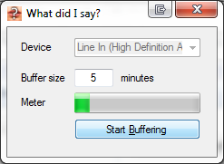

# What did I say?
This software records *n* minutes of audio in the background without saving it on disk, so you can run it 24/7 without ruining your hard drive or SSD. Once you ask yourself "What did I say?", you can save the last *n* minutes to disk.

## Origin

This software was requested on [Software Recommendations](https://softwarerecs.stackexchange.com/questions/18349/windows-software-to-constantly-record-the-last-x-minutes-of-audio-entering-the-m/35513) but none of the answers were really suitable, so I thought I need to create it.

## Requirements

* Windows
* .NET framework 4.5

## Command Line Options

* `-s`: Sample rate. Default: 44.1 kHz (CD quality)
* `-b`: Bits. Default: 16 bit resolution (CD quality)
* `-c`: Channels. Default: 2 channels (stereo)
* `-t`: Buffer time. Default: 5 minutes

## Dependencies

* [CommandLineParser](https://github.com/gsscoder/commandline)
* [NAudio](https://github.com/naudio/NAudio)

## Drawbacks

- no integrated playback. Just saving as WAV is possible at the moment.
- no support for MP3 due to licensing issues.
- some options only available via command line, not via user interface (e.g. sample rate, bits per sample, channels)
- check the list of known issues
- not a commercial application, do not expect the best support
